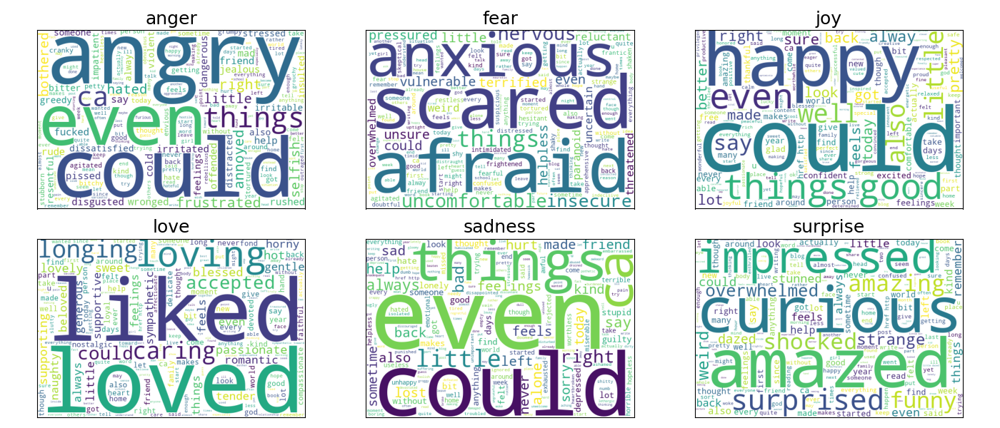

# Classifying emotions in English social media texts
### Capstone Project for UC Berkeley ML/AI Professional Certificate)

In this project, I attempt to classify the predominant emotion expressed in English social media texts into 6 categories: anger (0), fear (1), joy (2), love (3), sadness (4) and surprise (5).

I have always been curious about understanding more about human behaviour, and using data as the means to do so. The initial idea behind this project was sparked by watching *Inside Out 2* earlier this summer, and my motivation here is to strengthen my foundation in classification techniques, and build my skill-set in text analytics and Natural Language Processing (NLP).

## Data Overview
The data for this project was sourced from 3 different labeled Kaggle datasets:
1. **Emotion Classification NLP:** 7000 rows with 4 labeled emotions: anger, fear, joy, sadness

    https://www.kaggle.com/datasets/anjaneyatripathi/emotion-classification-nlp/data

2. **Emotions dataset for NLP:** 20k rows with all 6 emotion labels.

    https://www.kaggle.com/datasets/praveengovi/emotions-dataset-for-nlp?select=train.txt

3. **Emotions:** Over 400k rows with all 6 emotion labels.
    https://www.kaggle.com/datasets/nelgiriyewithana/emotions

After aggregating data from all the sources, we have an aggregated dataset with ~444k rows, and the pie chart below displays the breakdown of emotion labels in final dataset. *Joy* is the most represented emotion in 33.7% of observations, followed by *sadness* at 29%. The least detected emotion is *surprise* in only 3.5% of the observations. 

It is worth noting this imbalance in the dataset because it influences how we decide to score our classification models in the later steps.

We split this aggregated data into development (75%) and validation (25%) datasets. The former will be split into training and test sets in the model development stage. The validation set will not be used to build models, only to evaluate them.

### Clean and Pre-process Data
This involves the following steps:

1. **Removing unncessary data:** This involves removing any punctuation marks, URLs/HTML links, numbers, special characters, and emojis from the texts. 

2. **Convert to Lowercase**

3. **Lemmatization:** We use the spaCy english model to tokenize and lemmatize the words.

4. **Stop Words:** In addition to the nltk english stop words corpus, we include a few additional words like *'feel'*, *'think*', *'like'*, and so on which are very common in our dataset.

### Word Cloud
Before building any models, we want to see are there any words that are more commonly associated with a certain emotion, and to visualize this, we plot the wordclouds of texts with each emotion label.

As we would intuitively expect, words like 'anxious', 'scared', 'afraid' are common in texts with the label *fear*, and 'impreseed', 'curious', 'amazed' are common in texts with the label *surprise*. However, there are also words like 'could' and 'things' that appear to be common in multiple emotion labels.

## Models
We need to convert text into finite length vectors to be able to train our machine learning models.

### TF-IDF and Classification
TF-IDF stands for Text Frequency - Inverse Document Frequency and is based on the Bag of Words (BoW) approach, which simply counts the occurence of words in a document. TF-IDF contains insights about the less relevant and more relevant words in a document. Words that appear more frequently across documents (in this case, tweets) are given less weight/importance. **It highlights words that are frequent in a specific document but rare across the entire corpus, emphasizing their significance for that document.**

1. Multinomial NB: **Multinomial Naive Bayes is a classification algorithm based on Bayes' theorem that assumes features are distributed according to a multinomial distribution, typically used for text classification where features are word counts or frequencies. It calculates the probability of a document belonging to each class by considering the likelihood of each word given the class and applying Bayes' theorem to make predictions.**

2. Logistic Regression

3. Support Vector Classifier

4. Decision Trees and Random Forest

<b>Here are four widely used machine learning classification algorithms, each with its own strengths and suitable applications:

1. **Logistic Regression**: Despite its name, logistic regression is a linear model used for binary classification tasks. It estimates the probability that a given input belongs to a certain class by applying the logistic function to a linear combination of the input features. It's particularly useful for problems where the relationship between features and the outcome is approximately linear.

2. **Decision Trees**: Decision trees build a model by recursively splitting the data into subsets based on the most informative features. Each node in the tree represents a feature and a threshold, leading to different branches based on the feature values, and the leaves represent the class labels. They are easy to interpret and visualize but can be prone to overfitting.

3. **Random Forest**: An ensemble method that combines multiple decision trees to improve classification performance. Random Forest builds a multitude of decision trees using bootstrapped samples of the data and aggregates their predictions, typically through voting, to make the final classification. It helps mitigate overfitting and is robust to noise.

4. **Support Vector Machines (SVM)**: SVMs work by finding the hyperplane that best separates the classes in the feature space with the maximum margin. For non-linearly separable data, SVMs can use kernel functions to map the data into a higher-dimensional space where a linear separation is possible. They are effective for both linear and non-linear classification tasks and are known for their strong performance in high-dimensional spaces.

Each algorithm has its own strengths and weaknesses, and the choice of algorithm often depends on the specific characteristics of the data and the problem being solved.

In multi-class classification:

- **Macro-averaging** computes metrics (like precision, recall, or F1 score) for each class independently and then takes the average, treating all classes equally regardless of their size. This approach can highlight performance on smaller or less frequent classes.

- **Micro-averaging** aggregates the contributions of all classes to compute metrics, effectively treating each individual prediction equally, which is useful when dealing with imbalanced datasets as it emphasizes overall performance rather than class-specific performance.
</b>

<b>A precision-recall curve is a graphical representation of a classification model's performance, plotting precision against recall for various threshold values, helping to evaluate the trade-off between correctly identifying positive instances and minimizing false positives.
**Precision** measures the proportion of true positive predictions among all positive predictions made by the model.  
**Recall** measures the proportion of true positive predictions among all actual positive instances in the data.</b>

<!-- 

 -->

#### Evaluating Logistic Regression Classifier

### Word2Vec and Classification using Logistic Regression

*TF-IDF (Term Frequency-Inverse Document Frequency) and Word2Vec are both techniques used in natural language processing to represent text, but they do so in different ways. TF-IDF is a statistical measure that evaluates the importance of a word in a document relative to a collection of documents (corpus); it combines the term frequency (how often a word appears in a document) with the inverse document frequency (how rare the word is across the corpus), resulting in a weighted score that highlights unique and significant words. On the other hand, Word2Vec is a neural network-based approach that learns dense, continuous vector representations of words by capturing their contextual relationships through large corpora; words with similar meanings end up with similar vectors. While TF-IDF is useful for identifying keyword importance in a specific document, Word2Vec provides a richer, semantic understanding of word relationships.*

While TF-IDF gives us an understanding of relative importance of words, it fails to capture any semantic understanding of the words in a text. For e.g. the following two sentences, *I prefer going out over staying in.* and *I prefer staying in over going out.* would have the exact same representation with TF-IDF vectorizer, whereas their meaning is completely different and conveys two very different kinds of personalities.

In order to tackle this issue, we experiment with Word2Vec embeddings which, as the name implies, transforms a word into a vector of specified size. To train the model, we use an unsupervised learning technique which scans the entire corpus, and in this process the model determines which words the target word occurs with more often and captures the semantic closeness of the words to each other. Additionally, unlike BoW and TF-IDF transformer, the size of the vector does not have to be as large the number of features/words in our corpus. The model loses some of the interpretability because of this, but we achieve significant gains in terms of computational efficiency.

*<u>Note</u>:* We still pre-process the text, but for this model we do not use lemmatization.

#### Google News vs Custom Trained Word2Vec Model

<b>Using Google's pretrained Word2Vec model versus a custom-trained model has distinct advantages and trade-offs:

- **Google's Pretrained Word2Vec Model**: This model, trained on a large corpus like Google News, offers high-quality, general-purpose embeddings that capture a broad range of word meanings and relationships. It's convenient for many tasks, especially when data is limited, as it provides rich, pre-learned semantic information without the need for additional training.

- **Custom-Trained Word2Vec Model**: Training a custom model allows you to tailor the embeddings to the specific vocabulary and context of your dataset, which can capture domain-specific nuances and relationships more effectively. This is particularly beneficial for specialized or niche applications where general embeddings might not capture the relevant subtleties.

Choosing between the two depends on your specific needs: pretrained models are great for general applications and save time, while custom models are advantageous for specialized tasks requiring domain-specific insights.
</b>

To generate embeddings, we experiment with both Google's model which was trained on a huge corpus of Google News, and our custom model which learns from the training sample of our dataset, with approximately 200k observations. We look at the 10 words most similar to *'affectionate'*, and it is evident that Google's model performs much better at capturing the semantics here. In our custom model, there are a lot of words which could easily be the antonyms for *'affectionate'*.

#### Convert sentences to vectors

*To convert Word2Vec word embeddings into sentence embeddings, you typically aggregate the individual word vectors to represent the entire sentence. This can be done by several methods: one common approach is to average the vectors of all words in the sentence, providing a single vector that captures the overall meaning. Alternatively, you might sum the word vectors, or use more sophisticated techniques like weighted averaging, where weights are based on term frequency or other factors. For improved sentence representation, you could also apply techniques such as concatenation or advanced models that build on Word2Vec, such as Doc2Vec or transformer-based models like BERT, which generate more nuanced sentence embeddings. These aggregated vectors then serve as the sentence embeddings, reflecting the combined semantic content of the words in the sentence.*

### BERT Transformer and Keras for Classification

**BERT (Bidirectional Encoder Representations from Transformers) is a transformer-based model designed for natural language understanding, introduced by Google. Unlike traditional models that read text sequentially (left-to-right or right-to-left), BERT reads text in both directions simultaneously, capturing the context from both sides of a word or token. This bidirectional approach allows BERT to understand the meaning of words based on their full context, leading to improved performance on a range of NLP tasks such as question answering, sentiment analysis, and named entity recognition. BERT's pre-training on large text corpora followed by fine-tuning on specific tasks enables it to generate highly contextualized and nuanced representations of language, making it a powerful tool for various language understanding applications.

BERT embeddings can be explained to a layman as follows: Imagine you’re trying to understand the meaning of a word in a sentence. BERT is like a super-smart reader that looks at the whole sentence before and after the word to figure out its exact meaning. Instead of just looking at the word alone, BERT understands it based on the context of the entire sentence, so it gets a much clearer picture of what’s being said. This helps it do a better job at tasks like answering questions or summarizing text because it really understands the context of each word in the sentence.

Neural network classification is a machine learning approach where a network of interconnected nodes, or neurons, is trained to categorize data into predefined classes. Each neuron in the network processes input data through weighted connections and applies activation functions to transform the input into a meaningful output. During training, the network adjusts these weights based on the difference between its predictions and the actual class labels, using algorithms like backpropagation to minimize errors. The network learns to recognize patterns and features in the data, enabling it to classify new, unseen examples accurately. Essentially, neural network classification models are designed to identify and assign data to specific categories by learning from examples.**

## What is accuracy?
Classify a completely new dataset of 10 personal social media posts and see if they are classified correctly by the models.

## Hierarchical Classification
**Hierarchical classification is a structured approach to categorizing data where labels are organized in a tree-like structure, with broad categories divided into more specific subcategories. This method reflects a natural hierarchy, such as organizing documents into general topics and then into subtopics. 

In hierarchical classification, the model first predicts high-level categories and then uses those predictions to refine and predict more specific subcategories. For example, in classifying animals, a model might first determine if an animal is a mammal or a bird, and then further classify it into specific types like "cat" or "eagle."

This hierarchical approach helps manage complex classification tasks by breaking them down into simpler, more manageable steps, ensuring that the predictions align with the structured relationships among categories.**

## Next Steps

<b>To address imbalanced data in machine learning, several sampling techniques can be used to balance the distribution of classes. Here are some common methods:

1. **Oversampling**: This technique involves increasing the number of instances in the minority class to balance the class distribution. A popular method is **SMOTE (Synthetic Minority Over-sampling Technique)**, which creates synthetic examples of the minority class by interpolating between existing instances.

2. **Undersampling**: This approach reduces the number of instances in the majority class to balance the dataset. **Random Undersampling** randomly removes samples from the majority class, while **Tomek Links** and **Edited Nearest Neighbors** are more sophisticated methods that aim to remove noisy or redundant majority class examples.

3. **Hybrid Methods**: Combining both oversampling and undersampling techniques can be effective. For instance, **SMOTE + Tomek Links** first generates synthetic samples for the minority class and then cleans up the majority class by removing noisy instances.

4. **Cost-sensitive Learning**: Instead of changing the dataset, this technique adjusts the learning algorithm to pay more attention to the minority class. **Cost-sensitive classifiers** assign higher costs to misclassifications of the minority class, thereby improving model performance on imbalanced data.

5. **Cluster-based Oversampling**: Techniques like **Cluster Centroids** can be used to oversample by creating new instances based on clustering of the minority class, which helps in generating synthetic samples that are representative of the minority class.

6. **Adaptive Synthetic Sampling (ADASYN)**: An extension of SMOTE, ADASYN generates synthetic samples focusing more on difficult-to-classify examples, which helps improve the classifier's performance on hard-to-learn regions of the feature space.

Each technique has its own advantages and trade-offs, and the choice of method often depends on the specific characteristics of the dataset and the problem at hand.</b>

