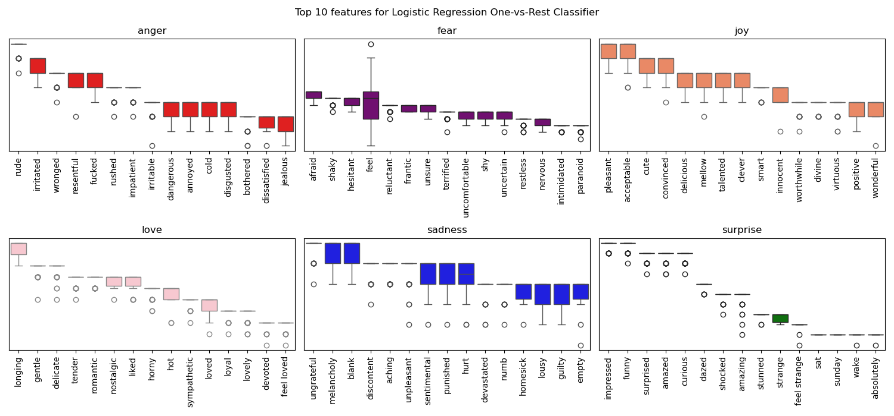

# Classifying emotions in English social media texts
### Capstone Project for UC Berkeley ML/AI Professional Certificate)
This project aims to develop a robust classification model to identify predominant emotion in English texts. By leveraging advanced machine learning techniques and natural language processing algorithms, we attempt to discern emotional undertones and categorize them into distinct states: anger (0), fear (1), joy (2), love (3), sadness (4) and surprise (5). The models will be trained on a large corpus of annotated texts to ensure high accuracy and generalizability. 

 Understanding emotion in English texts is fascinating because it unlocks insights into human feelings, intentions, and social dynamics that are often subtle and complex.The initial idea behind this project was sparked by watching *Inside Out 2* earlier this summer, and my motivation here is to strengthen my foundation in classification techniques, and build my skill-set in text analytics and Natural Language Processing (NLP).

 By analyzing emotional undertones, NLP can enhance user experiences across various applications, such as improving customer service through empathetic responses, refining content recommendations based on emotional context, and so on. This capability not only helps in personalizing interactions but also in building more intuitive and supportive technologies that resonate with users on a deeper level.

## Data Overview
The data for this project was sourced from 3 different labeled Kaggle datasets:
1. **Emotion Classification NLP:** 7000 rows with 4 labeled emotions: anger, fear, joy, sadness

    https://www.kaggle.com/datasets/anjaneyatripathi/emotion-classification-nlp/data

2. **Emotions dataset for NLP:** 20k rows with all 6 emotion labels.

    https://www.kaggle.com/datasets/praveengovi/emotions-dataset-for-nlp?select=train.txt

3. **Emotions:** Over 400k rows with all 6 emotion labels.
    https://www.kaggle.com/datasets/nelgiriyewithana/emotions

After aggregating data from all the sources, we have an aggregated dataset with ~444k rows, and the pie chart below displays the breakdown of emotion labels in final dataset. *Joy* is the most represented emotion in 33.7% of observations, followed by *sadness* at 29%. The least detected emotion is *surprise* in only 3.5% of the observations. 

It is worth noting this imbalance in the dataset because it influences how we decide to score our classification models in the later steps.

We split this aggregated data into development (75%) and validation (25%) datasets. The former will be split into training and test sets in the model development stage. The validation set will not be used to build models, only to evaluate them.

### Clean and Pre-process Data
NLP preprocessing typically involves the following steps:

1. **Removing unncessary data:** Remove any punctuation marks, URLs/HTML links, numbers, special characters, and emojis.

2. **Convert to Lowercase:** Ensures uniformity and avoid treating the same word in different cases as distinct

3. **Lemmatization:** We use the spaCy english model to tokenize and lemmatize the words.

4. **Stop Words:** In addition to the nltk English stop words, we include words like *'feel'*, *'think*', *'like'*, and so on which are very common in our dataset.

### Word Cloud
Before building any models, we want to see are there any words that are more commonly associated with a certain emotion.

As we would intuitively expect, words like 'anxious', 'scared', 'afraid' are common in texts with the label *fear*, and 'impreseed', 'curious', 'amazed' are common in texts with the label *surprise*. However, there are also words like 'could' and 'things' that appear to be common in multiple emotion labels.

## Models
We need to convert text into finite length vectors to be able to train our machine learning models.

### TF-IDF and Classification
TF-IDF stands for Text Frequency - Inverse Document Frequency and is based on the Bag of Words (BoW) approach, which simply counts the occurence of words in a document. TF-IDF contains insights about the relevancy of words in a documents. It highlights words that are frequent in a specific document (in this case, tweet/text) but rare across the entire corpus, emphasizing their significance.

After converting texts into a vector representation using TF-IDF, we experiment with a variety of classification techniques:

- **Multinomial Naive Bayes**: A classification algorithm based on Bayes' theorem that assumes features are distributed according to a multinomial distribution. This is typically used for text classification where features are word counts or frequencies. It calculates the probability of a document belonging to each class by considering the likelihood of each word given the class and applying Bayes' theorem to make predictions.

- **Logistic Regression**: This is a linear model used for binary classification tasks which estimates the probability that a given input belongs to a certain class. We use this for multi-class classification using 6 One-vs-Rest classifiers, one for each emotion label.

- **Support Vector Machines**: SVMs work by finding the hyperplane that best separates the classes in the feature space with the maximum margin. While non-linear hyperplanes are possible, for our project we use a linear kernel.

- **Decision Trees and Random Forests**: Decision trees build a model by recursively splitting the data into subsets based on the most informative features. They are easy to interpret and visualize but can be prone to overfitting. Random Forests is an ensemble approach that combines multiple decision trees using bootstrapped samples of the data and aggregates those to make the final classification. It helps mitigate overfitting and is robust to noise.

#### How to measure classification performance?

Accuracy, as the name implies, is the percentage of labels that are classified correctly. While a higher accuracy sore is always better, but in cases of highly imbalanced data, this may not capture the model performance accurately. 

$$Recall = \frac{True Positives}{True Positives + False Negatives}$$

We choose to look at recall, in addition to accuracy, since a false negative does not have a higher cost compared to a false positive. In simple terms, *recall*, for a specific class, is the percentage of labels with that class that are classified correctly. 

Using TF-IDF vectorization, even a simple (and fast) multinomial naive-bayes model has a high accuracy of 86% on the test data. However, if we look at recall by class, this model severly underperforms for *love* and *surprise* class labels, which are under-represneted in the data. SVM has an accuracy comparable to that of Logistic Regression, but again the recall metrics are lower for less frequent classes.

#### Precision Recall Curve
A precision-recall curve is a graphical representation of a classification model's performance, plotting precision against recall for various threshold values, helping to evaluate the trade-off between correctly identifying positive instances and minimizing false positives.

$$Precision = \frac{True Positives}{True Positives + False Positives}$$

The image corroborates with the story, that <u>**Logistic Regression** seems to be the best classifier for TF-IDF vectorization</u>, particularly beacuse of higher recall and accuracy in the underreprsented class labels.

<!-- 

 -->

#### Evaluating Logistic Regression Classifier using Validation Data

We kept 25% of the total data (~100k observations) separate to be used as a validation dataset to evaluate performance. TF-IDF vectorization + Logistic Regression classifier has a 89% accuracy of this data, and recall/precision/f1 metrics similar to the test dataset.

One advantage of using TF-IDF vectorization is the high interpretability of the classification problems. For each emotion label, the image below highlights the 15 most important features.

### Word2Vec Embeddings and Classification using SVM/Logistic Regression
There are two distinct disadvantages of using TF-IDF vectorization.It is a statistical measure with an understanding of relative importance of words, but it fails to capture any semantic understanding of the words in a text. Additionaly, the vector representations are sparse, and can have very high dimensionality. 

On the other hand, Word2Vec is a neural network-based approach that learns dense, continuous vector representations of words by capturing their contextual relationships: words with similar meanings have similar vector representations. To train the model, we use an unsupervised learning technique which scans the entire corpus, and in this process the model determines which words the target word occurs with more often. The vector size does not have to be as large as the vocabulary ( we use 300), but we lose a lot of the interpretability.

*<u>Note</u>:* We still pre-process the text, but for this model we do not use lemmatization.

#### Google News vs Custom Trained Word2Vec Model

Both of these approaches have distinct advantages and trade-offs:

- **Google's Pretrained Model**: This model is trained on a large corpus like Google News, offers high-quality, general-purpose embeddings that can capture a broad range of word meanings and relationships. Using this model is convenient in case of limited data or computational constraints as it does not require additional training.

- **Custom-Trained Model**: This approach allows us to tailor the embeddings to the specific vocabulary and context, which can capture domain-specific nuances and relationships more effectively. 

Since we are dealing with a very specific task here, and a large training sample of over 200k rows, the first instinct was to use a custom-trained model. However, when we look at the 10 words most similar to *affectionate*, it is evident that our custom-model is not able to capture the semantics of words very well. Most of the top 10 most similar words, in fact appear to be antonyms. For this reason, we are biased towards using the Google pre-trained model.

#### Convert sentences to vectors

To convert Word2Vec word embeddings into sentence embeddings, we have to aggregate the individual word vectors to represent the entire sentence. The most common approach to do so is to average the vectors of all the words in the sentence. Summing up the vectors can bias the results for sentences that are much longer. Alternatively, we can use weighted averaging, where weights are based on term frequency or other factors. 

For our project, we use IDF (Inverse Document Frequency) weights to average the word vectors into a single sentence vector. This has the same advantage as TF-IDF of highlighting words that are present in a sentence, but infrequent across the entire corpus.

In the image above, we try to visualize the cosine similarity between sentences using Google's pre-trained and our custom-trained Word2Vec embeddings. We decide to proceed with the former, since our custom-trained model apprears to have higher similarity scores for different emotions, especially *anger*/*fear* and *sadness*/*surprise*. 

#### Evaluating classification using Word2Vec

We build two classification models using the Word2Vec embeddings: One-vs-Rest Logistic Regression and a Support Vector Classfier. Upon comparing the accuracy and recall metrics, it is evident that Word2Vec embedding models underperform across the board.

While disappointing, this result is not entirely unexpected, due to a variety of reasons:

* *Sparse Dataset*: Despite having a large number of observations, we are dealing with a very limited vocabulary in our dataset. In such cases, TF-IDF may perform better because it directly measures term importance without relying on extensive context.
* *Short Texts*: Since most of the texts we look at are under 100 words, TF-IDF’s term weighting is more straightforward as Word2Vec’s context-based embeddings may not be able to capture sufficient information in such scenarios.
* *Domain-Specific Terminology*: We use Google News trained Word2Vec model, since our custom model did not do a great job at capturing semantics. However the disadvantage is that the training corpus does not accurately capture the relevance of words/terms.

### BERT Transformer and Keras for Classification

So far the best model is a One-vs-Rest Logistic Regression using TF-IDF embeddings. To see if we can improve upon this performance, we experiment with a Neural Network classification model using BERT embeddings.

**BERT** (Bidirectional Encoder Representations from Transformers) is a transformer-based model designed for natural language understanding, introduced by Google. Unlike traditional models that read text sequentially (left-to-right or right-to-left), BERT reads text in both directions simultaneously, capturing the context from both sides of a word or token. This bidirectional approach allows BERT to understand the meaning of words based on their full context, leading to improved performance. 

#### Outperforms Logistic Regression with TF-IDF Vectorization

## What is accuracy?
Classify a completely new dataset of 10 personal social media posts and see if they are classified correctly by the models.

<b>
1. **Anger**: "I can't believe you forgot my birthday again; this is unacceptable!"
2. **Fear**: "I heard a noise in the dark and couldn’t stop my heart from racing."
3. **Joy**: "Winning the championship was the happiest moment of my life!"
4. **Love**: "Every moment spent with you feels like a beautiful dream come true."
5. **Sadness**: "She felt an overwhelming sadness when she realized her old friend had moved away."
6. **Surprise**: "I was completely taken aback when I walked into the party and saw everyone there!"
7. **Anger**: "He slammed the door in frustration after the meeting went horribly wrong."
8. **Fear**: "The thought of speaking in public made her stomach churn with anxiety."
9. **Joy**: "Seeing the sunrise after a long night felt like a gift from the heavens."
10. **Love**: "His sweet words and gentle touch made her fall deeper in love every day."

Certainly! Here are ten more sentences, each reflecting one of the specified emotions:

1. **Anger**: "I was furious when I discovered that someone had tampered with my work."
2. **Fear**: "The eerie silence in the abandoned house made me shiver with dread."
3. **Joy**: "The laughter of children playing in the park filled my heart with pure joy."
4. **Love**: "Their long walks together in the moonlight showed how deeply they cared for each other."
5. **Sadness**: "He felt a deep sadness as he watched the final credits roll on the movie he had loved."
6. **Surprise**: "She was astonished to find a surprise letter from her old friend waiting on her desk."
7. **Anger**: "The constant delays and excuses from the company made me lose my patience."
8. **Fear**: "Driving through the foggy night, he could barely see a few feet ahead, feeling a chill of fear."
9. **Joy**: "Her face lit up with joy when she saw the beautiful, unexpected gift."
10. **Love**: "Every day, he made sure to remind her how much he loved her with little gestures and kind words."</b>

## Hierarchical Classification
**Hierarchical classification is a structured approach to categorizing data where labels are organized in a tree-like structure, with broad categories divided into more specific subcategories. This method reflects a natural hierarchy, such as organizing documents into general topics and then into subtopics. 

In hierarchical classification, the model first predicts high-level categories and then uses those predictions to refine and predict more specific subcategories. For example, in classifying animals, a model might first determine if an animal is a mammal or a bird, and then further classify it into specific types like "cat" or "eagle."

This hierarchical approach helps manage complex classification tasks by breaking them down into simpler, more manageable steps, ensuring that the predictions align with the structured relationships among categories.**

## Next Steps

<b>To address imbalanced data in machine learning, several sampling techniques can be used to balance the distribution of classes. Here are some common methods:

1. **Oversampling**: This technique involves increasing the number of instances in the minority class to balance the class distribution. A popular method is **SMOTE (Synthetic Minority Over-sampling Technique)**, which creates synthetic examples of the minority class by interpolating between existing instances.

2. **Undersampling**: This approach reduces the number of instances in the majority class to balance the dataset. **Random Undersampling** randomly removes samples from the majority class, while **Tomek Links** and **Edited Nearest Neighbors** are more sophisticated methods that aim to remove noisy or redundant majority class examples.

3. **Hybrid Methods**: Combining both oversampling and undersampling techniques can be effective. For instance, **SMOTE + Tomek Links** first generates synthetic samples for the minority class and then cleans up the majority class by removing noisy instances.

4. **Cost-sensitive Learning**: Instead of changing the dataset, this technique adjusts the learning algorithm to pay more attention to the minority class. **Cost-sensitive classifiers** assign higher costs to misclassifications of the minority class, thereby improving model performance on imbalanced data.

5. **Cluster-based Oversampling**: Techniques like **Cluster Centroids** can be used to oversample by creating new instances based on clustering of the minority class, which helps in generating synthetic samples that are representative of the minority class.

6. **Adaptive Synthetic Sampling (ADASYN)**: An extension of SMOTE, ADASYN generates synthetic samples focusing more on difficult-to-classify examples, which helps improve the classifier's performance on hard-to-learn regions of the feature space.

Each technique has its own advantages and trade-offs, and the choice of method often depends on the specific characteristics of the dataset and the problem at hand.</b>

