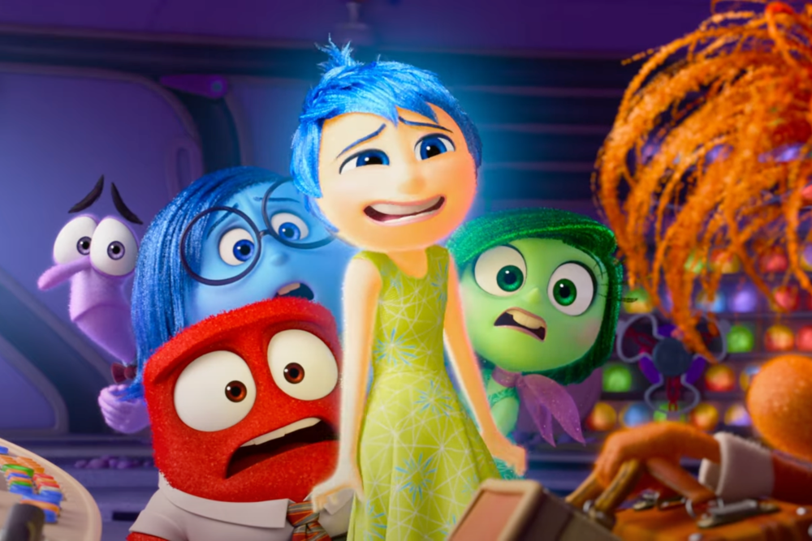

# Classifying emotions in English social media texts
### Capstone Project for UC Berkeley ML/AI Professional Certificate)

In this project, I attempt to classify the predominant emotion expressed in English social media texts into 6 categories: anger (0), fear (1), joy (2), love (3), sadness (4) and surprise (5).

I have always been curious about understanding more about human behaviour, and using data as the means to do so. The initial idea behing this project was sparked by watching *Inside Out 2* earlier this summer, and my motivation here is to strengthen my foundation in classification techniques, and build my skill-set in text analytics and Natural Language Processing (NLP).

## Data Overview
The data for this project was sourced from 3 different labeled Kaggle datasets:
1. **Emotion Classification NLP:** 7000 rows with 4 labeled emotions: anger, fear, joy, sadness

    https://www.kaggle.com/datasets/anjaneyatripathi/emotion-classification-nlp/data

2. **Emotions dataset for NLP:** 20k rows with all 6 emotion labels.

    https://www.kaggle.com/datasets/praveengovi/emotions-dataset-for-nlp?select=train.txt

3. **Emotions:** Over 400k rows with all 6 emotion labels.
    https://www.kaggle.com/datasets/nelgiriyewithana/emotions

After aggregating data from all the sources, we have an aggregated dataset with ~444k rows, and the pie chart below displays the breakdown of emotion labels in final dataset. *Joy* is the most represented emotion in 33.7% of observations, followed by *sadness* at 29%. The least detected emotion is *surprise* in only 3.5% of the observations. 

It is worth noting this imbalance in the dataset because it influences how we decide to score our classification models in the later steps.

We split this aggregated data into development (75%) and validation (25%) datasets. The former will be split into training and test sets in the model development stage. The validation set will not be used to build models, only to evaluate them.

### Clean and Pre-process Data
This involves the following steps:

1. **Removing unncessary data:** This involves removing any punctuation marks, URLs/HTML links, numbers, special characters, and emojis from the texts. 

2. **Convert to Lowercase**

3. **Lemmatization:** We use the spaCy english model to tokenize and lemmatize the words.

4. **Stop Words:** In addition to the nltk english stop words corpus, we include a few additional words like *'feel'*, *'think*', *'like'*, and so on which are very common in our dataset.

### Word Cloud
Before building any models, we want to see are there any words that are more commonly associated with a certain emotion, and to visualize this, we plot the wordclouds of texts with each emotion label.

As we would intuitively expect, words like 'anxious', 'scared', 'afraid' are common in texts with the label *fear*, and 'impreseed', 'curious', 'amazed' are common in texts with the label *surprise*. However, there are also words like 'could' and 'things' that appear to be common in multiple emotion labels.

## Models
We need to convert text into finite length vectors to be able to train our machine learning models.

### TF-IDF and Classification
TF-IDF stands for Text Frequency - Inverse Document Frequency and is based on the Bag of Words (BoW) approach, which simply counts the occurence of words in a document. TF-IDF contains insights about the less relevant and more relevant words in a document. Words that appear more frequently across documents (in this case, tweets) are given less weight/importance.

1. Multinomial NB

2. Logistic Regression

3. Support Vector Classifier

4. Decision Trees and Random Forest

<!-- 

 -->

#### Evaluating Logistic Regression Classifier

### Word2Vec and Classification using Logistic Regression
While TF-IDF gives us an understanding of relative importance of words, it fails to capture any semantic understanding of the words in a text. For e.g. the following two sentences, *I prefer going out over staying in.* and *I prefer staying in over going out.* would have the exact same representation with TF-IDF vectorizer, whereas their meaning is completely different and conveys two very different kinds of personalities.

In order to tackle this issue, we experiment with Word2Vec embeddings which, as the name implies, transforms a word into a vector of specified size. To train the model, we use an unsupervised learning technique which scans the entire corpus, and in this process the model determines which words the target word occurs with more often and captures the semantic closeness of the words to each other. Additionally, unlike BoW and TF-IDF transformer, the size of the vector does not have to be as large the number of features/words in our corpus. The model loses some of the interpretability because of this, but we achieve significant gains in terms of computational efficiency.

*<u>Note</u>:* We still pre-process the text, but for this model we do not use lemmatization.

#### Google News vs Custom Trained Word2Vec Model
To generate embeddings, we experiment with both Google's model which was trained on a huge corpus of Google News, and our custom model which learns from the training sample of our dataset.

### BERT Transformer and Keras for Classification

## What is accuracy?
Classify a completely new dataset of 10 personal social media posts and see if they are classified correctly by the models.

## Hierarchical Classification

## Next Steps

